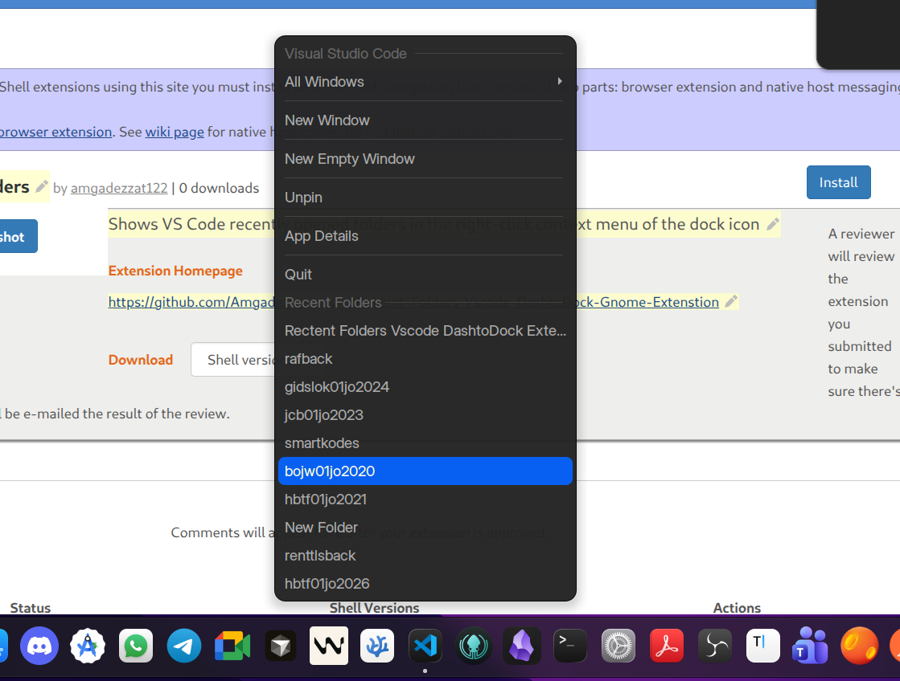

# Smart Dock Menus — GNOME Shell Extension

App-aware quick-access menus for your dock icons. Right-click any supported app to instantly access what matters — no opening the app first, no searching.



---

## Features

- Shows your VS Code recent folders and workspaces in the dock right-click menu
- Reads directly from VS Code's SQLite database (`state.vscdb`) for an accurate, up-to-date list
- Falls back to `storage.json` if the database is unavailable
- Supports standard, Snap, and Flatpak VS Code installations
- Displays folder name + parent path (e.g. `myproject  ~/Code`) matching VS Code's own style
- Opens folders in a new VS Code window on click
- Optional Wayland compatibility mode (`--ozone-platform=x11`)
- Configurable maximum number of recent folders (1–50)

---

## Requirements

- GNOME Shell **45, 46, 47, or 48**
- [Dash-to-Dock](https://extensions.gnome.org/extension/307/dash-to-dock/) or Ubuntu Dock
- Visual Studio Code (standard `.deb`, Snap, or Flatpak)
- `python3` in PATH (for SQLite querying)

---

## Installation

### Manual (recommended for development)

```bash
# Clone the repository
git clone https://github.com/Amgadezzat-andro/Rectent-Folders-Vscode-DashtoDock-Gnome-Extenstion.git

# Copy to GNOME extensions directory
cp -r "Rectent-Folders-Vscode-DashtoDock-Gnome-Extenstion" \
    ~/.local/share/gnome-shell/extensions/vscode-recent-folders@amgad

# Compile the settings schema
glib-compile-schemas ~/.local/share/gnome-shell/extensions/vscode-recent-folders@amgad/schemas/

# Restart GNOME Shell (X11: Alt+F2 → r → Enter | Wayland: log out and back in)
# Then enable the extension
gnome-extensions enable vscode-recent-folders@amgad
```

### From the zip

```bash
gnome-extensions install vscode-recent-folders@amgad.zip
# Log out and back in, then enable via GNOME Extensions app
```

---

## Configuration

Open **GNOME Extensions → VSCode Recent Folders → Settings**:

| Setting | Default | Description |
|---|---|---|
| Maximum Recent Folders | 10 | How many items appear in the menu (1–50) |
| Use Ozone X11 Platform | Off | Passes `--ozone-platform=x11` to VS Code (for Wayland sessions) |

---

## How It Works

1. On first load, the extension pre-warms a folder cache by querying VS Code's SQLite database via a small Python helper (`fetch_recent.py`).
2. When you right-click the VS Code dock icon, cached folders appear instantly under a **Recent Folders** separator.
3. In the background, the cache refreshes so the next open reflects any new folders.
4. If the database is unavailable, the extension falls back to reading `~/.config/Code/User/globalStorage/storage.json`.

**Supported data sources (in priority order):**

| Source | Path |
|---|---|
| Standard install DB | `~/.config/Code/User/globalStorage/state.vscdb` |
| Snap install DB | `~/snap/code/common/.config/Code/User/globalStorage/state.vscdb` |
| Flatpak install DB | `~/.var/app/com.visualstudio.code/config/Code/User/globalStorage/state.vscdb` |
| Fallback JSON | `~/.config/Code/User/globalStorage/storage.json` |

---

## Troubleshooting

**No folders appear in the menu**
- Make sure `python3` is installed and in your PATH.
- Verify VS Code has been opened at least once (the database must exist).
- Check that Dash-to-Dock is installed and the VS Code icon is pinned to the dock.
- On Wayland, try enabling **Use Ozone X11 Platform** in settings.

**Extension not loading**
- Confirm your GNOME Shell version is 45, 46, 47, or 48 (`gnome-shell --version`).
- Re-run `glib-compile-schemas` after installation.

---

## License

MIT License — see [LICENSE](LICENSE) for details.
